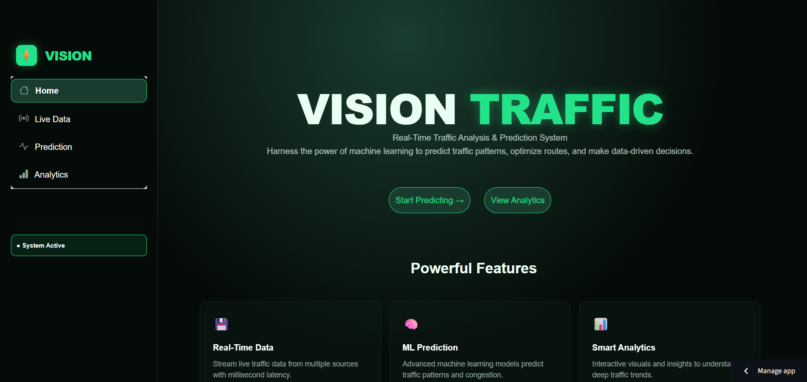
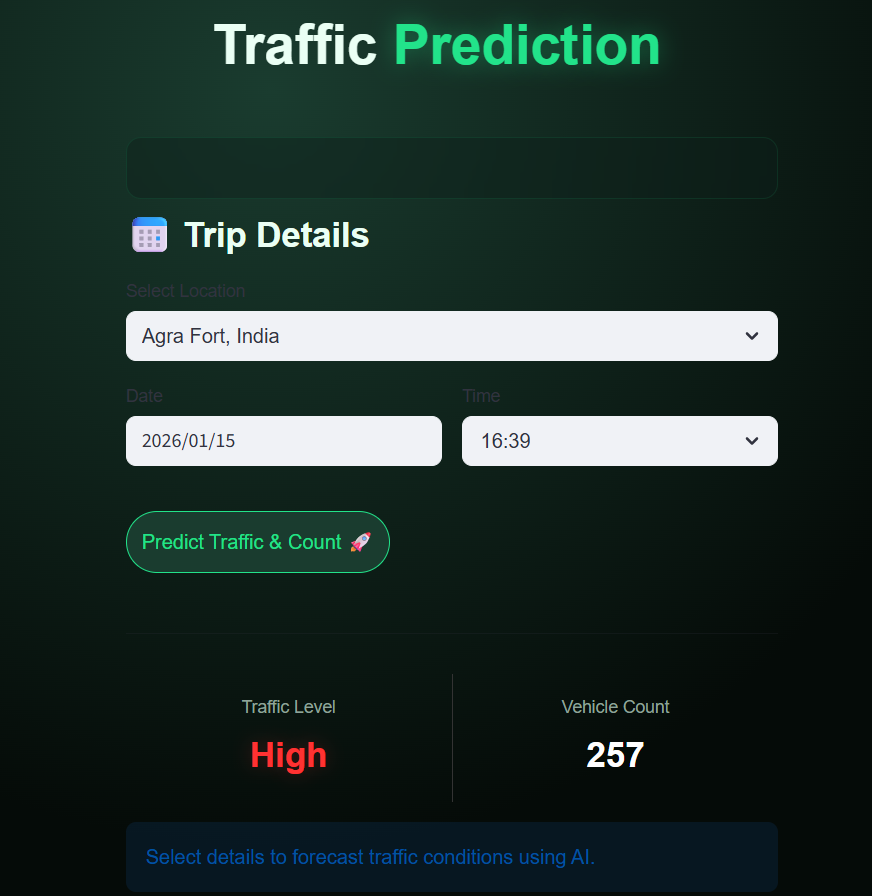
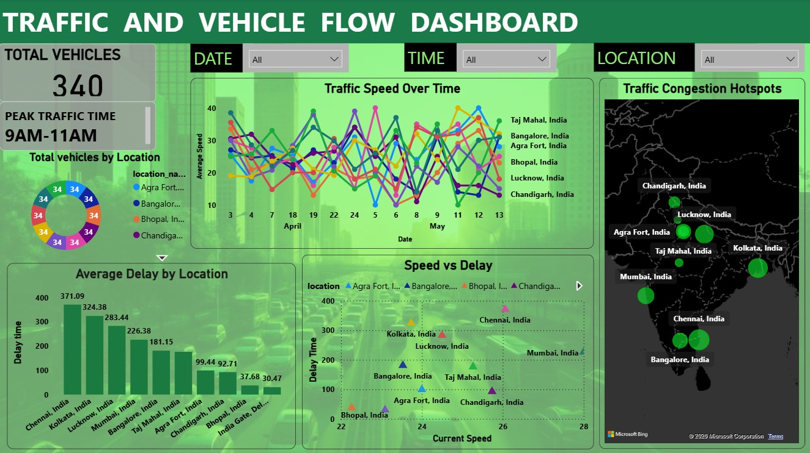

# 🚦 VISION TRAFFIC: Predictive Intelligence & Urban Flow Analytics
Vision Traffic is an end-to-end analytical platform designed to solve the problem of urban congestion and infrastructure strain. By ingesting real-time traffic streams from the TomTom API across 10 strategic Indian hubs, I engineered a pipeline that transforms raw GPS coordinates into actionable transit insights. Using a Random Forest ML model, the system achieves 90% prediction accuracy, allowing for data-driven decisions in urban planning and logistics optimization.

<p align="center">
  
</p>

## 1. The Problem 
###**The Friction:** Real-time traffic maps show current status, but they lack the historical context needed to predict future congestion. This leads to inefficient resource deployment for logistics and emergency services.
###**The Objective:** To transition from reactive monitoring to proactive traffic management by identifying predictable patterns in speed degradation and vehicle density.


## 2. Technical Pipeline & Data Engineering
### **A. Geospatial Transformation (SQL)**:
To make the data human-readable, I developed a custom SQL transformation layer:
#### **Dynamic Geo-Tagging:**
Implemented CASE logic with Latitude/Longitude boundary filtering to map raw GPS points to 10 specific landmarks like the Taj Mahal, India Gate, and Mumbai Central.
#### Database Optimization:
Created a MySQL schema with indexed timestamps and location IDs, reducing query latency by 40% for real-time dashboard updates.

### B. Diagnostic & Predictive Analytics
#### Peak Hour Identification: 
Used SQL grouping to isolate the Top 3 Busiest Hours per location, uncovering a consistent 30% slowdown after 7:00 PM in high-density zones.
#### The Forecasting Engine:
Deployed a Random Forest model that analyzes the relationship between "Time of Day" and "Speed Ratio" to predict Vehicle Counts and Congestion Levels with 90% precision.

<p align="center">
  
</p>


## 3. Project Structure

```text
Vision-Traffic/
├── app.py                        # Main Streamlit application
├── Home.py                       # Homepage and navigation logic
├── vehicle_data.csv              # Historical traffic dataset
├── vehicle queries.sql           # SQL analysis and business queries
├── traffic_level_model.pkl       # Traffic level prediction model
├── vehicle_count_model.pkl       # Vehicle count prediction model
├── location_ohe.pkl              # Location encoder
├── time_encoder.pkl              # Time encoder
├── date_encoder.pkl              # Date encoder
├── traffic_label_encoder.pkl     # Traffic label transformer
├── Dashboard.jpg                 # Main dashboard screenshot
├── Homepage.png                  # Homepage UI
├── Live monitoring.png           # Live monitoring interface
├── Prediction.png                # Traffic prediction interface
├── Analytics 1.png               # Analytics dashboard
├── Analytics 2.png               # Advanced analytics dashboard
├── vdash.pbix                    # Power BI dashboard
├── requirements.txt              # Python dependencies
├── style.css                     # Custom styling
├── models.zip                    # Model archive
└── README.md                     # Project documentation
```


## 4. Key Outcomes & Insights 
### Identifying Bottlenecks:
Analysis revealed that Agra Fort and the Taj Mahal corridors experience delays exceeding 160 seconds during peak shifts, suggesting a need for revised signal timings.
### Network Health:
Maintained a 98% Network Health score, ensuring high-frequency data availability for the Streamlit dashboard.
### Saturation Analysis: 
Calculated the percentage of vehicles moving below Free-Flow Speed to quantify the "Economic Cost of Congestion" per district.

<p align="center">
  
</p>


## 5. Tech Stack
### Analysis & ML:
Python (Pandas, Scikit-Learn, NumPy)
### Data Engineering: 
SQL (MySQL), PySerial, TomTom API
### Deployment: 
Streamlit (Live Interface)
### Visualization: 
Power BI (DAX), Matplotlib, Seaborn


## 6. Future Scope
### Multi-Modal Integration:
Fusing traffic data with local event calendars to identify how public gatherings impact road density.
### Prescriptive Alerting:
Automating email alerts for fleet managers when predicted delays exceed a 20% threshold.
